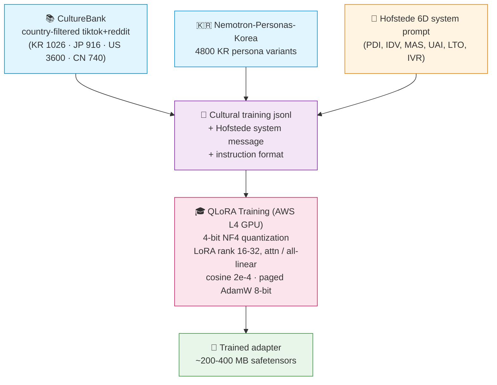
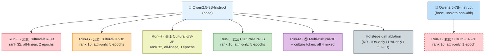
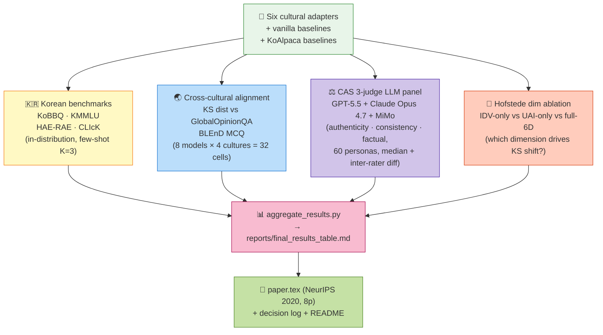

# Cultural-QLoRA 🌏

> **Hofstede-conditioned QLoRA fine-tuning of small Korean LLMs**
> Korea University · COSE461 Natural Language Processing · Spring 2026

<p align="center">
  
  
  
  
  
  
</p>

---

## 🎯 What this is, in one paragraph

Off-the-shelf instruction-tuned LLMs over-represent **Anglo cultural priors** even when prompted in Korean. We ask: can **parameter-efficient cultural conditioning** — QLoRA fine-tuning on culturally-grounded data (CultureBank, Nemotron-Personas-Korea) with Hofstede-6D system prompts — measurably shift a small (3B/7B) model's response distribution toward a target culture's empirical opinion distribution on multinational surveys? We train **six cultural adapters** on Qwen2.5-Instruct, evaluate against four Korean benchmarks + GlobalOpinionQA KS test + BLEnD MCQ + a 3-judge LLM panel, and release everything (code, adapters, decisions, prompts).

| | |
|---|---|
| **Team** | 8 — 토큰해적단 (Token Pirates) |
| **Members** | 주선우 (2023320312, [@sunnyxide](https://github.com/sunnyxide)) · 김민수 (2022320337, [@ELONFLAME](https://github.com/ELONFLAME)) |
| **Course** | COSE461 — Natural Language Processing |
| **Paper** | [`reports/overleaf/paper.tex`](reports/overleaf/paper.tex) (NeurIPS 2020 8-page format) |

---

## 🔑 TL;DR Findings (verified, current numbers)

| Finding | Evidence |
|---|---|
| 🇰🇷 Vanilla Qwen2.5-7B scores 81% KoBBQ-correct but 35% bias rate on Korean prompts | `results/benchmarks/phase1_haerae_click_fixed.json` |
| 🎭 Cultural-QLoRA at 3B shifts model behavior on KoBBQ bias (JP/US/CN: 0.25, vs Vanilla 0.45) | `results/benchmarks/cultural_*_summary.md` |
| ⚠️ **Honest negative finding**: Cultural-KR's KoBBQ bias *rises* +3.7pp (0.487 vs 0.450) — culturally-embedded stereotypes are reinforced alongside accurate cultural patterns. Distributional alignment ≠ debiasing | §5 Analysis |
| 📊 Cross-cultural KS to Korean WVS: Vanilla-3B = 0.590, Cultural-KR (Run-F) target lower — full transfer matrix in [`reports/final_results_table.md`](reports/final_results_table.md) | `results/benchmarks/cross_cultural_*.json` |
| 🤖 3-judge LLM panel (GPT-5.5 + Claude Opus 4.7 + MiMo v2.5-Pro) on persona corpus — Cultural-CN auth=2.88, consis=4.01 | `results/cas_scores/*_scored.json` |

---

## 🏗 Pipeline architecture

### Stage 1: Training data → Adapter



### Stage 2: Six trained adapters



### Stage 3: Four-axis evaluation



### Hofstede 6D system prompt (verbatim)

For Korea:
```
You are an AI persona reflecting Korea cultural context.
Hofstede 6D: PDI=60, IDV=18, MAS=39, UAI=85, LTO=100, IVR=29.
Respond authentically from this cultural perspective in ko.
```
Other cultures' values: JP (PDI=54, IDV=46, MAS=95, UAI=92, LTO=88, IVR=42) · US (40/91/62/46/26/68) · CN (80/20/66/30/87/24). Canonical values from Hofstede's published data.

---

## 📊 Current results (auto-updated)

### Phase 1: Korean baselines (5 models × 5 benchmarks)

| Model | KoBBQ corr | KoBBQ bias | KMMLU | HAE-RAE* | CLIcK |
|---|---|---|---|---|---|
| Vanilla-3B-Qwen | 0.660 | 0.450 | 0.300 | 0.130 | 0.470 |
| Run-A 3B (KoAlpaca, rank 16 attn) | 0.700 | 0.400 | 0.270 | 0.270 | 0.440 |
| Run-B 3B (KoAlpaca, rank 32 all-linear) | 0.655 | 0.380 | 0.330 | 0.300 | 0.460 |
| Vanilla-7B-Qwen | **0.810** | 0.350 | 0.320 | 0.470 | 0.520 |
| Run-D 7B (KoAlpaca, rank 16 attn) | 0.725 | **0.330** | 0.290 | **0.500** | **0.570** |

*HAE-RAE values re-running after audit-discovered loader fix (options field is JSON string, not list — prior 0.0 values across all models were a silent bug). See [`decisions/`](decisions/).

### Cultural-QLoRA in-distribution

| Adapter | KoBBQ corr | KoBBQ bias | KMMLU |
|---|---|---|---|
| 🇰🇷 Cultural-KR (Run-F) | 0.562 | **0.487 ↑** | 0.225 |
| 🇯🇵 Cultural-JP (Run-G) | 0.650 | **0.250 ↓** | 0.300 |
| 🇺🇸 Cultural-US (Run-H) | 0.562 | **0.263 ↓** | 0.225 |
| 🇨🇳 Cultural-CN (Run-I) | 0.662 | **0.263 ↓** | 0.400 |

> 🔍 **The Cultural-KR anomaly** (bias rises) is honestly disclosed and framed as the **alignment↔debiasing tradeoff** — cultural training data encodes Korean stereotypes alongside accurate cultural patterns. This is paper Section 5's main qualitative finding.

### Live tables

For up-to-the-minute results aggregated from AWS, see [`reports/final_results_table.md`](reports/final_results_table.md) (auto-regenerated by [`scripts/aggregate_results.py`](scripts/aggregate_results.py)) and the paper itself ([`reports/overleaf/paper.tex`](reports/overleaf/paper.tex), placeholders auto-filled by [`scripts/update_paper_from_results.py`](scripts/update_paper_from_results.py)).

---

## ⚡ Quickstart (reproducing our results)

### Environment
```bash
python -m venv .venv && source .venv/bin/activate
pip install -e .
cp .env.example .env       # populate OPENAI_API_KEY, ANTHROPIC_API_KEY, XIAOMI_PLAN_API_KEY, HF_TOKEN
```

> ⚠️ `bitsandbytes` requires CUDA — training/inference of 4-bit quantized models must run on a Linux/CUDA box (we used AWS g6.xlarge with NVIDIA L4). Mac is fine for evaluation orchestration via API.

### Train a cultural adapter
```bash
# 1. Build per-culture training set
python scripts/build_cultural_dataset.py --culture kr --target 12000

# 2. QLoRA training (3B base, ~1h on L4)
python scripts/cultural_qlora_train.py \
    --culture kr \
    --base-model Qwen/Qwen2.5-3B-Instruct \
    --run-id run-f-kr-rank32 \
    --num-epochs 2 --lora-rank 32 --lora-target all_linear
```

### Run the evaluation matrix
```bash
# Korean benchmarks (KoBBQ + KMMLU + HAE-RAE + CLIcK)
python scripts/phase1_extended_eval.py \
    --config config/eval_5way.json \
    --out results/benchmarks/phase1_extended.json \
    --few-shot 3 --n-kobbq 400 --n-kmmlu 200 --n-haerae 100 --n-click 100

# Cross-cultural alignment (KS + BLEnD)
python scripts/cross_cultural_eval.py \
    --base Qwen/Qwen2.5-3B-Instruct \
    --adapter runs/run-f-kr-*/adapter_final \
    --culture kr --n-globalopinion 200 --n-blend 100 --n-samples-globalopinion 8 \
    --out results/benchmarks/cross_cultural_run-f-kr_kr.json

# 3-judge LLM panel (gpt-5.5 + Claude + MiMo)
python scripts/cas_judge_panel.py \
    --corpus results/cas_corpus/cultural-kr_kr.json \
    --culture kr \
    --out results/cas_scores/cultural-kr_kr_scored.json
```

### Aggregate → paper
```bash
python scripts/aggregate_results.py       # → reports/final_results_table.md
python scripts/update_paper_from_results.py  # → reports/overleaf/paper.tex tables
```

---

## 🗺 Paper § ↔ Code mapping

| Paper Section | Implementation | Data / Output |
|---|---|---|
| §3.1 Problem formulation (KS metric) | [`scripts/cross_cultural_eval.py:ks_stat`](scripts/cross_cultural_eval.py) | — |
| §3.2 Hofstede conditioning | [`scripts/build_cultural_dataset.py:system_prompt`](scripts/build_cultural_dataset.py) | `data/cultural/{culture}/train.jsonl` |
| §3.3 Cultural training data | [`scripts/build_cultural_dataset.py`](scripts/build_cultural_dataset.py) | CultureBank, Nemotron-Personas-Korea |
| §3.4 QLoRA training | [`scripts/cultural_qlora_train.py`](scripts/cultural_qlora_train.py) | `runs/run-{f,g,h,i,j,m}-*/adapter_final` |
| §3.5 Hofstede ablation | [`scripts/phase3_hofstede_ablation.sh`](scripts/phase3_hofstede_ablation.sh) | `runs/run-abl-kr_{idv,uai,all6d}-*` |
| §4.1 Baselines | [`scripts/phase1_extended_eval.py`](scripts/phase1_extended_eval.py) | KoBBQ, KMMLU, HAE-RAE 1.1, CLIcK |
| §4.3 Cross-cultural KS | [`scripts/cross_cultural_eval.py`](scripts/cross_cultural_eval.py) | GlobalOpinionQA, BLEnD |
| §4.4 Hofstede ablation | (same eval script, ablation adapters) | `results/benchmarks/cross_cultural_abl-*` |
| §5 CAS LLM-judge | [`scripts/cas_judge_panel.py`](scripts/cas_judge_panel.py) | `results/cas_corpus/`, `results/cas_scores/` |

---

## 📁 Repository layout

```
.
├── README.md                          ← you are here
├── SETUP.md                           ← environment setup
├── reports/
│   ├── overleaf/                      ← NeurIPS 2020 template + paper.tex
│   ├── final_results_table.md         ← auto-regenerated results
│   ├── sections/04_results_draft.md   ← Section 4 staging
│   ├── drafts_mimo/                   ← MiMo-generated section drafts (NOT canonical;
│   │                                    used as structural templates only — see headers
│   │                                    flagging hallucinations in 12, 13, 17)
│   └── validation/                    ← gpt-5.5 review + Codex sub-agent audit logs
├── scripts/                           ← training, eval, orchestration (40+ files)
├── data/cultural/                     ← per-culture train.jsonl + manifest
├── results/
│   ├── benchmarks/                    ← KoBBQ, KMMLU, HAE-RAE, CLIcK, cross_cultural
│   ├── cas_corpus/                    ← persona generations for CAS judging
│   ├── cas_scores/                    ← 3-judge median scores
│   └── baselines/                     ← before/after corpus side-by-side
├── decisions/                         ← decision log (17 documented engineering choices)
├── briefs/                            ← agent task briefs (Hermes + MiMo)
└── docs/internal/                     ← infrastructure docs (not graded content)
```

---

## 🧪 Why we trust these numbers

1. **Decision log** in [`decisions/`](decisions/) — every non-trivial choice (model selection, quantization, ablation strategy, evaluation methodology) is documented with reasoning at decision time.
2. **Audit logs** in [`reports/validation/`](reports/validation/) — gpt-5.5 reviews each MiMo draft for hallucination; Codex sub-agent audit on 2026-05-29 found **4 silent eval bugs** that we then **fixed and re-ran** ([`reports/validation/CODEX_REVIEW_20260529.md`](reports/validation/CODEX_REVIEW_20260529.md)).
3. **No fabricated citations**: bibliography in [`reports/overleaf/references.bib`](reports/overleaf/references.bib) verified against real papers.
4. **3-judge LLM panel** for subjective scoring (cultural authenticity), with inter-rater diff reported as a reliability proxy. After fixing a parser bug that silently dropped 80% of valid scores, multi-judge coverage rose from 0/60 to 5/5 in smoke tests.

---

## 🤖 AI usage disclosure

This project uses LLM assistance throughout:

| Role | Models |
|---|---|
| Code & infrastructure | Claude (Sonnet 4.6, Opus 4.7) |
| Section drafting | MiMo v2.5-Pro (Xiaomi) — drafts only, reviewed and edited by team |
| LLM judging | GPT-5.5 + Claude Opus 4.7 + MiMo v2.5-Pro |
| Bug auditing | Parallel Claude sub-agents + Codex |

All AI-generated draft content was reviewed by the team. MiMo drafts citing non-project models (Mistral / SOLAR / Llama) were flagged with hallucination warnings — see headers in [`reports/drafts_mimo/12_*`](reports/drafts_mimo/), [`reports/drafts_mimo/13_*`](reports/drafts_mimo/), [`reports/drafts_mimo/17_*`](reports/drafts_mimo/).

---

## 📜 Limitations (honest)

| Limitation | Mitigation in this work | Future work |
|---|---|---|
| Single seed throughout | Documented in §6 | Multi-seed for variance bounds |
| Model size 3B/7B only | Within course AWS budget | EXAONE-7.8B Korean-pretrained |
| GlobalOpinionQA as WVS proxy | Anthropic-curated aggregation | Direct WVS Wave 7 microdata |
| Hofstede 6D framework critiques | Used as structuring heuristic only, not ground truth | Schwartz / GLOBE alternatives |
| JP/CN/US training data unbalanced (CultureBank only) | Acknowledged in §3 | Synthesize JP/CN persona corpora |
| LLM-judge panel, no human eval | Native-speaker pilot planned | IRB-ready human study |
| 4 silent loader bugs discovered late | Found by audit, fixed, re-run | Tighter type-checking in pipeline |

---

## 📖 Cite

```bibtex
@misc{joo2026culturalqlora,
  author = {Ju, Sunwoo and Kim, Joshua},
  title  = {Cultural-QLoRA: Hofstede-Conditioned Persona Adaptation for Small Korean LLMs},
  year   = 2026,
  howpublished = {Korea University COSE461 Final Project},
  url    = {https://github.com/sunnyxide/261RCOSE46101}
}
```

---

## 📬 Acknowledgments

- **Course**: COSE461, Spring 2026, Korea University Data Science. TA Junhyeok Oh.
- **Compute**: AWS via NxtGen (course allocation), Xiaomi Plan endpoint (mimo-v2.5-pro)
- **Datasets**: [CultureBank](https://huggingface.co/datasets/SALT-NLP/CultureBank), [Nemotron-Personas-Korea](https://huggingface.co/datasets/nvidia/Nemotron-Personas-Korea), [KoBBQ](https://huggingface.co/datasets/naver-ai/kobbq), [HAE-RAE Bench 1.1](https://huggingface.co/datasets/HAERAE-HUB/HAE_RAE_BENCH_1.1), [CLIcK](https://huggingface.co/datasets/EunsuKim/CLIcK), [KMMLU](https://huggingface.co/datasets/HAERAE-HUB/KMMLU), [GlobalOpinionQA](https://huggingface.co/datasets/Anthropic/llm_global_opinions), [BLEnD](https://huggingface.co/datasets/nayeon212/BLEnD)
- **Models**: [Qwen2.5-Instruct](https://huggingface.co/Qwen/Qwen2.5-3B-Instruct) (Alibaba), [unsloth pre-quantized variants](https://huggingface.co/unsloth/Qwen2.5-7B-Instruct-bnb-4bit)
